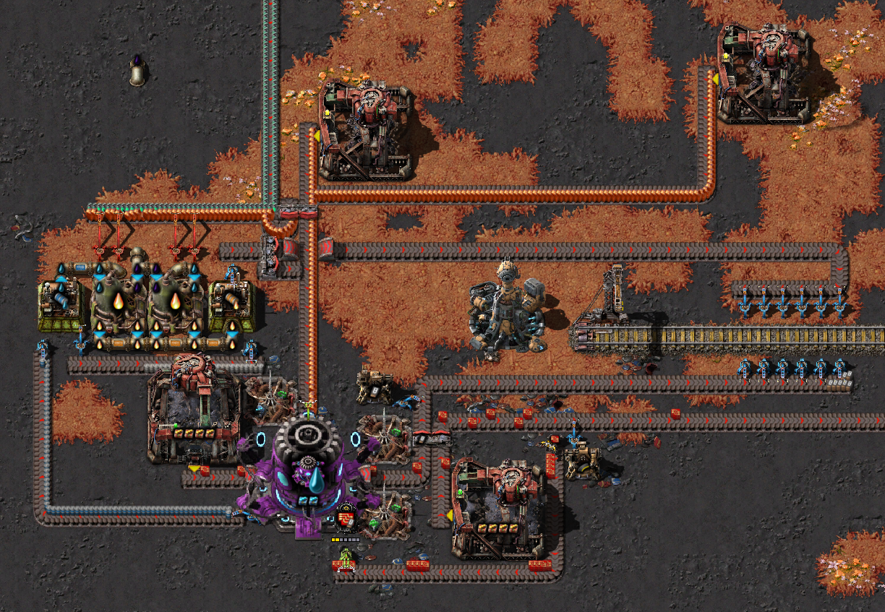
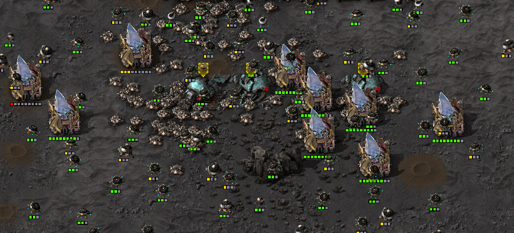
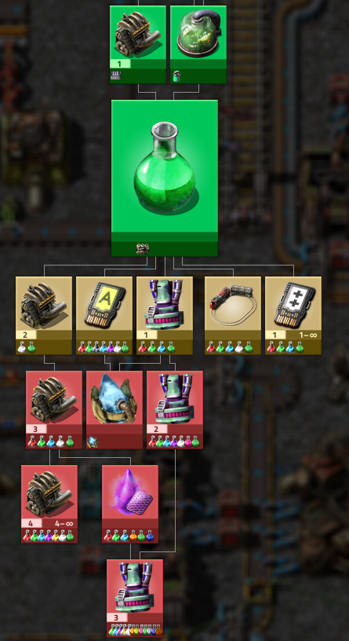
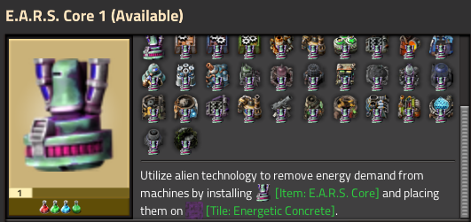
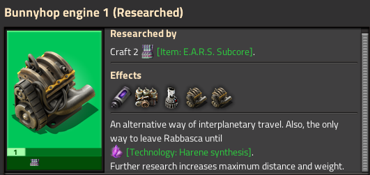
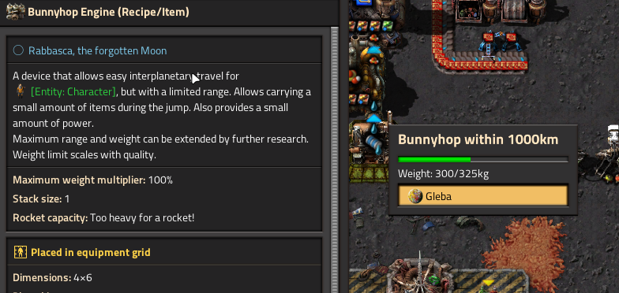

## Rabbasca, the forgotten Moon
Welcome to Rabbasca, a long forgotten place of powerful but well protected technology. It presents unique challenges and alternative ways to solve problems. 

### Power
Rabbasca emits an energy field from deep below, that provides a limited amount of energy, but renders all your power generation useless.
The field provides enough energy for a decent base, but for an expanding factory, you will need to listen closer to the forgotten technologies buried here.

### Ancient Vaults
Ancient vaults are scattered across the surface. Currently inactive, but the nearby consoles look hackable. 
Hacked vaults can be fed in exchange for resources that just so happen to be the basics of a factory to be built.
Be prepared though, there are some robots patrolling and their surroundings look like long forgotten battlefields...

### Alertness 
Rabbascan defense robots don't care about pollution or whatever else you might be doing at a safe distance from their vaults. They are a protective measure and never attack or expand. 
They also won't evolve over time, but the vaults share an alert level. Defensive responses get stronger the more vaults are hacked at once. Since hacks expire over time, you always have control over the current alert level. Keeping it low gives easy access to resources, but raising it to extreme levels might force them to reveal more of their mysterious technology.

## Rewards

### Tasty consumables, for you and your factory
Rabbasca is mostly barren, but the few available consumables are extremely nutritious. Brew powerful protein shakes that can be eaten by you and by your Biochambers, making them more relevant in places where nutrients are not easily available. Turbofuel is a great Rocket fuel alternative that provides high top speeds for vehicles.

### Machineception
The Machining Assembler assembles machines. And with a huge efficiency bonus it is pretty good at it, too. It can not produce any parts or intermediate products, but has you covered for all the things that make a good factory.

### Energy flows everywhere, you just need to listen
The E.A.R.S. Core is a strange device that can be installed in most machines to remove electricity demands and draw power from their surroundings instead. Special flooring is required to operate these machines.

### Jump across the Stars
The Bunnyhop Engine allows you to travel between Moons and their planets, or even between far apart planets with enough research. Launching a rocket on Rabbasca requires post-aquilo technology, so until then you have to rely on your (tool-enhanced) feet to leave and to move limited amounts of Rabbasca-exclusive products to other planets. Since this technology can be pretty game-altering, there are a few settings to tweak your bunnyhops.   

### Warp your machines into place
If you provoke the local defense protocols hard enough, they might start warping in help from somewhere else. That could become a problem, but if you could steal this technology you could use it to construct your bases by warping them in from other planets without needing to ship them first...

## Credits
This mod relies on the amazing work of other creators. Thanks for making Rabbasca possible.
- Assets for Machining Assembler, Vault Pylons and Remote Provider by [Hurricane](https://mods.factorio.com/user/Hurricane046) 
- Assets for Vault, Vault console, and Vault access cards from [Krastorio 2](https://mods.factorio.com/mod/Krastorio2Assets)

Also see (Credits.md)[https://github.com/PizzaPlanner/planet-rabbasca/blob/master/Credits.md]